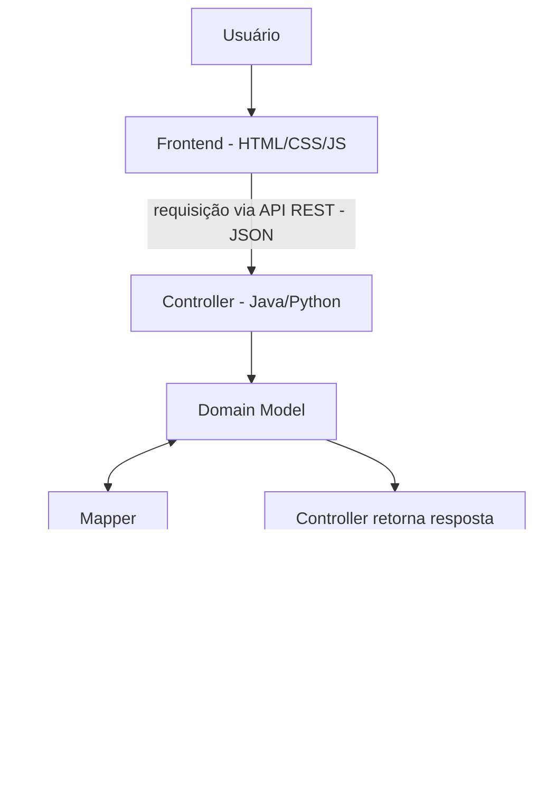

# Fluxo Normal do Sistema

```mermaid
graph TD;
    Usuario[Usuário]
    Frontend[Frontend - HTML/CSS/JS]
    Controller[Controller - Java/Python]
    DomainModel[Domain Model]
    Mapper[Mapper]
    PersistenceModel[Persistence Model]
    BancoDeDados[Banco de Dados]
    Resposta[Controller retorna resposta]
    Atualiza[Frontend atualiza tela para o usuário]

    Usuario --> Frontend
    Frontend -- "requisição via API REST - JSON" --> Controller
    Controller --> DomainModel
    DomainModel <--> Mapper
    Mapper <--> PersistenceModel
    PersistenceModel --> BancoDeDados
    DomainModel --> Resposta
    Resposta --> Atualiza
```

> O fluxo acima representa o caminho de uma requisição comum no sistema, desde o usuário até o banco de dados e de volta para a interface.
